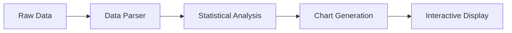

# GlobalMedia Sentiment Analysis Dashboard 🌐📊


A modern, responsive dashboard for analyzing global media sentiment using advanced data visualization techniques, analyzing public reactions to United States Presidential Executive Actions. Built with Next.js, TypeScript, and Chart.js.

## 🌟 Features

- **Real-time Sentiment Analysis** - Track sentiment trends across various media sources
- **Interactive Visualizations** - Four distinct chart types for comprehensive data analysis:
  - Line charts for temporal trend analysis
  - Pie charts for sentiment distribution
  - Bar charts for comparative analysis
  - Histograms for statistical distribution
- **Responsive Design** - Seamless experience across all device sizes
- **Type-Safe Implementation** - Fully typed interfaces using TypeScript
- **Modern Tech Stack** - Built with the latest versions of Next.js and React

## 🚀 Quick Start

```bash
# Clone the repository
git clone https://github.com/Jonathan-Hsueh/globalmedia.git

# Install dependencies
npm install

# Run the development server
npm run dev
```

Visit [http://localhost:3000](http://localhost:3000) to see the dashboard in action.

## 🛠 Technical Architecture

### Data Visualization Components

```typescript
// Chart Data Interfaces
interface ChartDataset {
  type?: 'line' | 'bar' | 'pie';
  label: string;
  data: number[];
  // ... styling properties
}

interface ChartData {
  labels: string[];
  datasets: ChartDataset[];
}
```

### Core Technologies

- **Frontend Framework**: Next.js 15.1.7
- **UI Library**: React 19.0.0
- **Type System**: TypeScript 5
- **Visualization**: Chart.js 4.4.8
- **Styling**: TailwindCSS 3.4.1
- **Animation**: Framer Motion 12.4.7

## 📊 Visualization Types

1. **Sentiment Trend Analysis**
   - Line chart tracking sentiment over time
   - Customizable time ranges
   - Interactive data points

2. **Sentiment Distribution**
   - Pie chart showing proportion of sentiments
   - Color-coded categories
   - Hover effects for detailed information

3. **Comparative Analysis**
   - Bar chart comparing different metrics
   - Side-by-side comparison
   - Customizable metrics

4. **Statistical Distribution**
   - Histogram showing sentiment frequency
   - Normal distribution overlay
   - Bin size customization

## 💻 Development

```bash
# Run development server with Turbopack
npm run dev

# Build for production
npm run build

# Start production server
npm run start

# Run linting
npm run lint
```

## 🎨 Design Philosophy

Our visualization design follows these core principles:

- **Clarity**: Clean, uncluttered representations of data
- **Interactivity**: Responsive charts with hover states and animations
- **Accessibility**: Color schemes chosen for readability and accessibility
- **Responsiveness**: Adaptive layouts for all screen sizes
- **Performance**: Optimized rendering and data handling

## 📈 Data Processing Pipeline



## 🙋‍♂️ Authors

**Jonathan Hsueh** - [GitHub Profile](https://github.com/Jonathan-Hsueh)
**Wavy Yang** - [GitHub Profile](https://github.com/Wavy77)
**Chase Brewer** - [GitHub Profile](https://github.com/chasethecc)
**Noah Ruderman** - [GitHub Profile](https://github.com/NoahTheCoolDude)
**Gabe Kung** - [GitHub Profile](https://github.com/ieatyoursushi)

---

<div align="center">

[](https://www.typescriptlang.org/)

</div>
